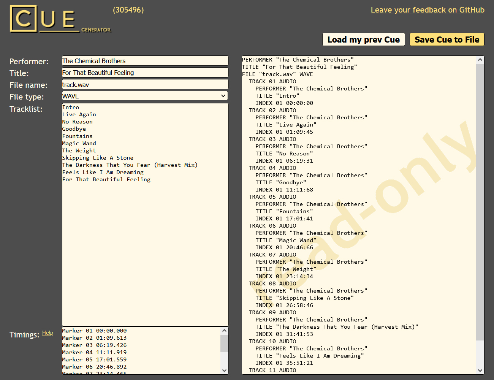

### track_sum

track_sum is a command-line utility that allows you to calculate the cumulative time duration of a list of track durations. It takes a list of track durations in the format "mm:ss.sss" and calculates the running total as each track duration is added to the previous total.

#### Usage

1. Create a text file named `input.txt` containing a list of track durations, with each duration on a separate line in the format "mm:ss.sss".
2. Compile the program, or if it's already compiled, open a terminal or command prompt.
3. Run the program by entering the following command:
   ```shell
   ./track_sum
   ```
   Replace `./track_sum` with the appropriate command if needed based on your system.
4. The program will display the running total after each track duration is added, both on the terminal and in the `output.txt` file.

#### Example

##### Input (`input.txt`):

```
0:00.000
1:09.613
5:09.813
4:52.493
5:49.640
3:45.333
2:27.573
3:44.160
4:43.093
4:09.573
6:57.680
```

##### Output (`output.txt`):

```
00:00.000
01:09.613
06:19.426
11:11.919
17:01.559
20:46.892
23:14.465
26:58.625
31:41.718
35:51.291
42:48.971
```

---



For example, you can generate a cue file with this output time durations in online generator https://cuegenerator.net
